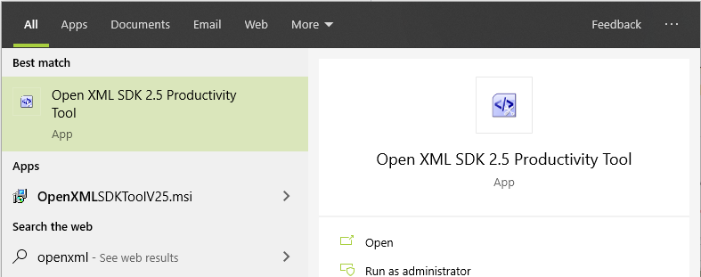
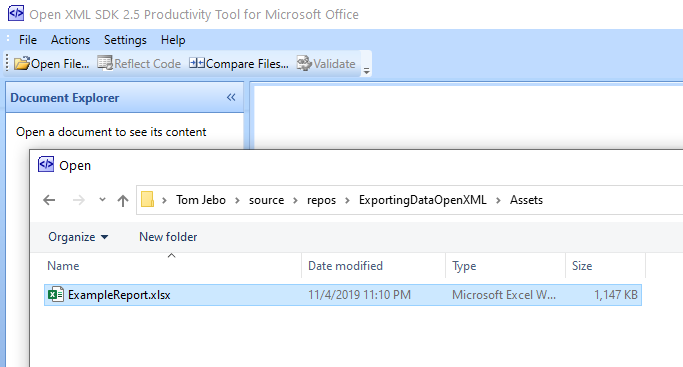
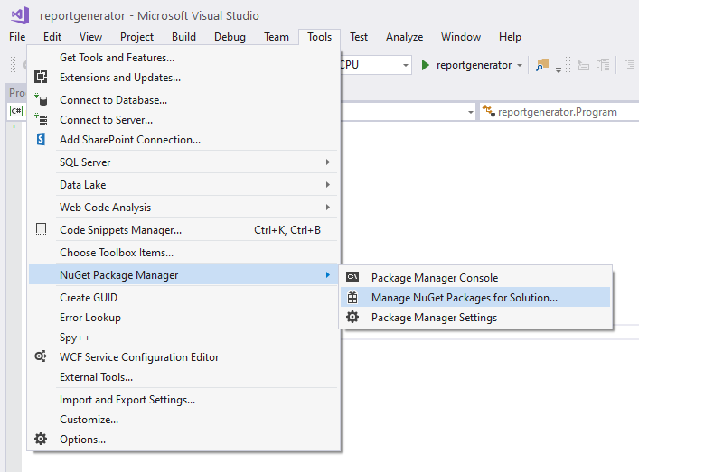
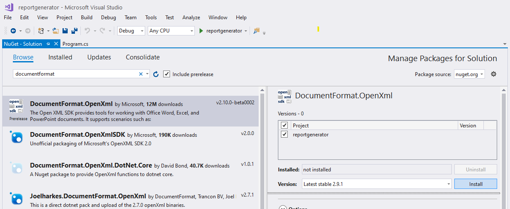
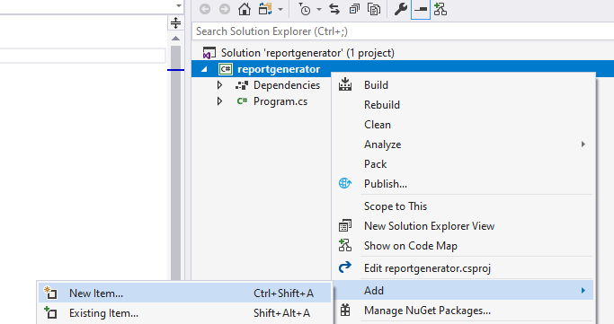
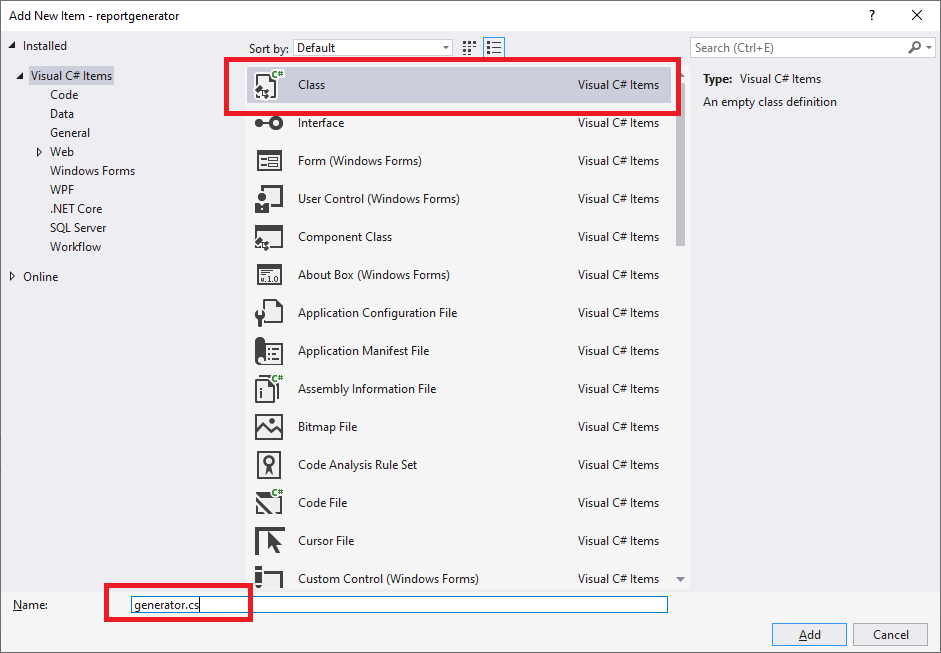
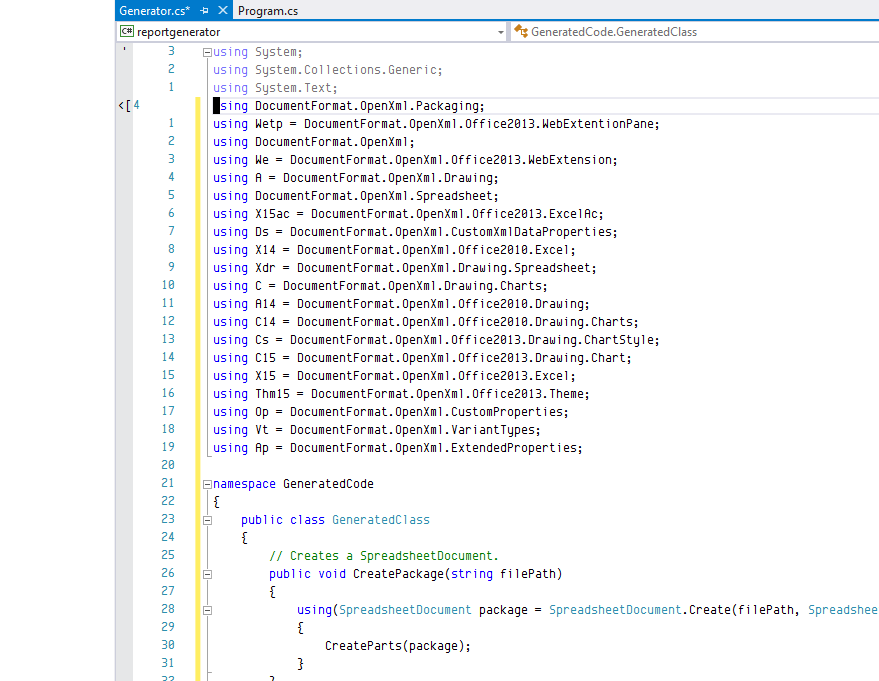
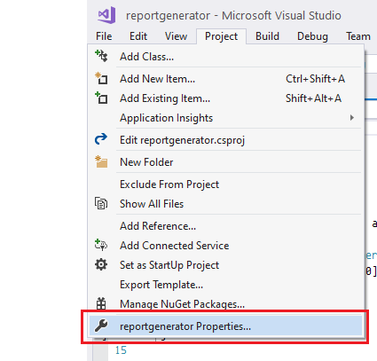
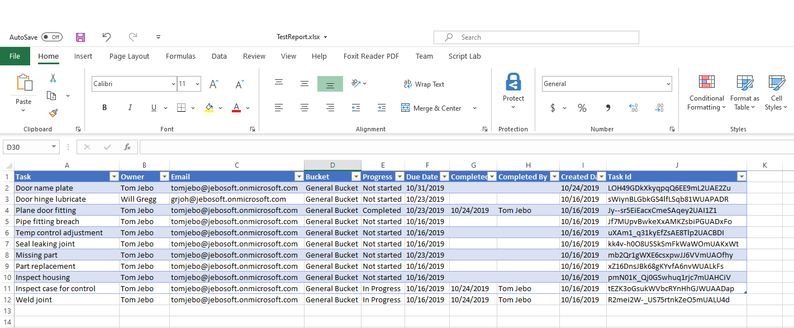

# Module1 Tutorial

## What we will accomplish

In Module 1, you will start by using the Open XML SDK Productivity Tool. This reflects C# code from a template document provided in the Assets folder. This provides the base from which customizations can be made.

We will then add that reflected code to a C# .Net Core project and test it to make sure it generates the same workbook we started with.

## Reflect code to build our report programmatically

1. From the start menu, run the Open XML SDK Productivity Tool:

    

1. And open the example report workbook from which we'll build our code:

    `Assets\ExampleReport.xlsx`

    

1. On the toolbar, select "Reflect Code":

    

1. You should now see the reflected C# code in the "Reflected Code" tab:

    

    Keep the tool window open and move to the next section.

## Setup the project for Open XML SDK use

1. Open the base project in Visual Studio by double clicking the following solution file in Windows Explorer:

    `PracticeSolution\Module1\reportgenerator\reportgenerator.sln`

1. Once Visual Studio opens the project, go to the Nuget package manager:

    

1. Browse by searching for "documentformat" and install the latest stable package:

    

    Click "OK" and "I Accept" on next two dialogs to install the package.

    NOTE: Alternative to installing the Nuget package, since the initial project provided by the repo already has the package installed, you can simply "restore" the package to make sure it's loaded. To do this, right click on the solution in Solution Explorer and select "Restore Nuget Packages" from the context menu:

    

## Add the reflected code to our project

1. Add a new item to the `reportgenerator` project and choose C# module:

    

1. Name the new item:

    `generator.cs`

    Like this:

    

1. Open Generator.cs for editing.

1. Select everything but the `using` statements like this:

    

1. Back in the Open XML SDK Productivity Tool, copy the reflected code:

   

1. In Visual Studio, paste to replace the selected code so it looks like this:

   

### Learn: Take a look at the [documentation on creating a spreadsheet document](https://docs.microsoft.com/en-us/office/open-xml/how-to-create-a-spreadsheet-document-by-providing-a-file-name) with the OpenXML SDK to understand what is happening in the `CreatePackage` function. 

1. Replace the following line:

    ```csharp
    namespace GeneratedCode
    ```

    With:

    ```csharp
    namespace reportgenerator
    ```

1. And replace:

    ```csharp
    public class GeneratedClass
    ```

    With:

    ```csharp
    public class Generator
    ```

1. Then in `Main` function back in `Program.cs`, replace:

    ```csharp
    Console.WriteLine("Hello World!");
    ```

    With:

    ```csharp
    Generator g = new Generator();
    g.CreatePackage(args[0]);
    Console.WriteLine("Hit Enter to finish...");
    Console.ReadLine();
    ```

1. The code in `Program.cs` should look like this:

    ```csharp
    using System;

    namespace reportgenerator
    {
        class Program
        {
            static void Main(string[] args)
            {
                Generator g = new Generator();
                g.CreatePackage(args[0]);
                Console.ReadLine();
            }
        }
    }
    ```

1. Hit `Ctrl-Shift-b` to build the solution and make sure there are no errors.

1. Open `Project | Properties`

    

1. In the Debug tab, add the following string to `Application arguments:`

    `$(SolutionDir)TestReport.xlsx`

    So it looks like this:

    

1. Hit `Ctrl-s` to save the properties change.

1. Now if you run the project in debug using `F5`, you will see the console windows appear and stay until you hit `Enter`. In the solution directory, you will see the following file:

    `PracticeSolution\Module1\reportgenerator\TestReport.xlsx`

1. Open the workbook with Excel to make sure the `Focus Task Data` worksheet looks like this:

    

1. You can now close Visual Studio reportgenerator project as we will be loading a new project in the next module. You can also close the Open XML SDK Productivity Tool as we won't need that going forward. 

## Summary

You now have a code base which generates a template workbook. This will allow you to customize the report and make it data driven. 

Next step, go to [Module 2](Module2.md) and follow the tutorial to create your data driven sheet generator.

