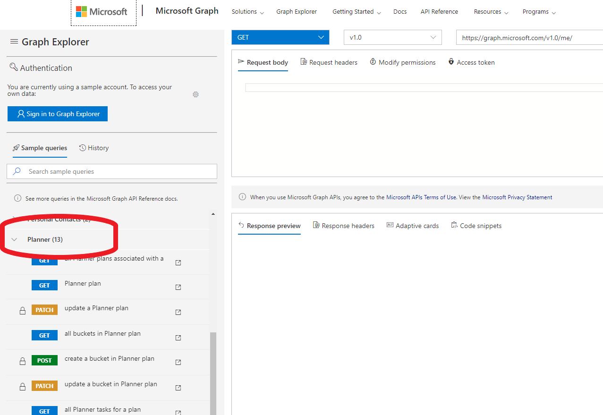
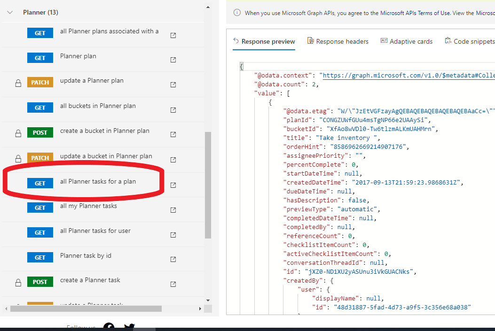

# Module2 Tutorial

## What we will accomplish

In Module 2, you will modify the report generation code to use Microsoft Graph data for building the worksheet table.

First we will have to generate some data from Microsft Graph and for this we will use Planner data.

## Create the Microsoft Graph data

1. Go to the Microsoft Graph Explorer in your web browser using this link: 

    [Microsoft Graph Explorer](https://developer.microsoft.com/en-us/graph/graph-explorer)

    No need to log in or enter credentials. We will use stock sample data for our development. 

1. In the left hand panel, select the "Planner" samples: 

    

1. Now use the `all Planner tasks for a plan` sample query to get our task data: 

    

1. Select all and copy the json in the response, pasting it into a new file at the following path and name:

    `PracticeSolution\Module2\tasksdata.json`

### Learn: Review [Accessing Planner Data from Graph](https://docs.microsoft.com/en-us/graph/planner-concept-overview) and [Planner Task Graph API](https://docs.microsoft.com/en-us/graph/api/resources/plannertask?view=graph-rest-beta) to understand how this JSON data is generated and used.

## Processing the data in report generation code

The report generation project from Module 1 has been copied to Module2 and upgraded to include code that will generate worksheet table data based on json information from Microsoft Graph. We need to feed it only the new task data from our Microsof Graph Explorer query above.

1. Load the report generation solution by double clicking the following file in Windows Explorer:

    `PracticeSolution\Module2\reportgenerator\reportgenerator.sln`

    To see the new code, in `Solution Explorer` open `generateTaskDataWorksheet.cs`. 

### Learn: Most of the code here is about algorithmically transferring the data in the JSON task information into the cell strings in the spreadsheet. Read about [how to set cell string data in Open XML SDK here](https://docs.microsoft.com/en-us/office/open-xml/how-to-insert-text-into-a-cell-in-a-spreadsheet).
    
    The JSON processing is done in `initDataObject` in `Generator.cs`.

#### MacOS: In `initDataObject()` within `Generator.cs`, find the line: 

    `using (StreamReader r = new StreamReader(@"..\..\..\..\..\tasksdata.json"))`

#### and change all the back-slashes to forward-slashes:

    `using (StreamReader r = new StreamReader(@"../../../../../tasksdata.json"))`

### Learn: To understand the JSON processing, check out the [New System.Text.JSON blog](https://devblogs.microsoft.com/dotnet/try-the-new-system-text-json-apis/).

1. Open the `Generator.cs` module and find the `CreateParts` function. In that function look for the following lines which create the data worksheet and the table definition:

    ```csharp
        WorksheetPart worksheetPart1 = workbookPart1.AddNewPart<WorksheetPart>("rId3");
        GenerateWorksheetPart1Content(worksheetPart1);

        TableDefinitionPart tableDefinitionPart1 = worksheetPart1.AddNewPart<TableDefinitionPart>("rId1");
        GenerateTableDefinitionPart1Content(tableDefinitionPart1);
    ```

    Change these to call the new data driven functions in`generateTaskDataWorksheet.cs`:

    ```csharp
        WorksheetPart worksheetPart1 = workbookPart1.AddNewPart<WorksheetPart>("rId3");
        generateTaskDataWorksheet(worksheetPart1);
        //GenerateWorksheetPart1Content(worksheetPart1);

        TableDefinitionPart tableDefinitionPart1 = worksheetPart1.AddNewPart<TableDefinitionPart>("rId1");
        generateTaskTableContent(tableDefinitionPart1);
        //GenerateTableDefinitionPart1Content(tableDefinitionPart1);
    ```

### Learn: To see what is happening in the above code, read about [adding a new worksheet](https://docs.microsoft.com/en-us/office/open-xml/how-to-insert-a-new-worksheet-into-a-spreadsheet) and [defining a table definition](https://docs.microsoft.com/en-us/dotnet/api/documentformat.openxml.spreadsheet.table?view=openxml-2.8.1) to a workbook. 

1. Open `Project | Properties`

    

1. In the Debug tab, add the following string to `Application arguments:`

    `$(SolutionDir)TestReport.xlsx`

    So it looks like this:

    

#### MacOS: For Visual Studio on MacOS, you can should the program argument to `TestReport.xlsx` from the [Run menu](Assets/runmenu.png) and [Custom configuration dialog](Assets/customconfigdlg.png).

1. Use `F5` to build and run the generator. The console window will stop after displaying some output and wait for you to hit `Enter`.

1. Load the workbook into Excel by opening Windows explorer and navigating to:
    `PracticeSolution\Module2\reportgenerator\TestReport.xlsx`

#### MacOS: On MacOS, you can open `TestReport.xlsx` from the command line using [this path](Assets/openxlsxpath.png).

1. Verify the data in the `Focus Task Data` worksheet against the task json data we pulled from Microsoft Graph. Does it match?

Question: Why are there no Owner or Email?

1. Go to the `Cover` worksheet and right click on the pivot tables and hit `Refresh`. Do the associated charts update to reflect the data?

    
