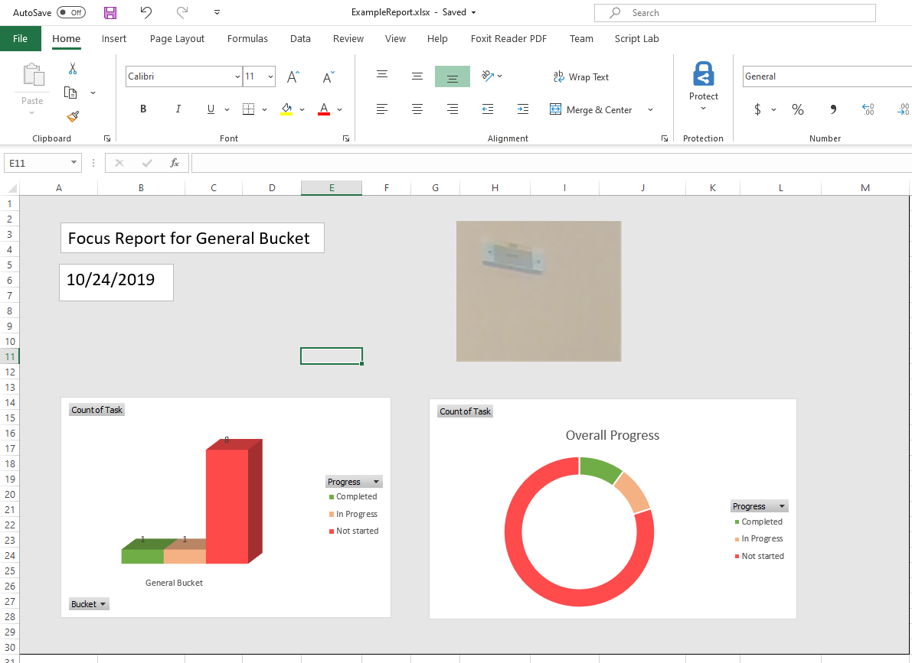
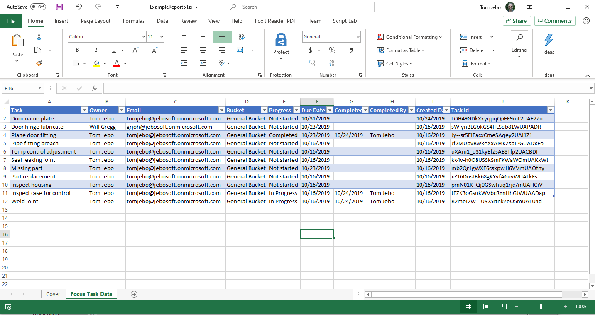
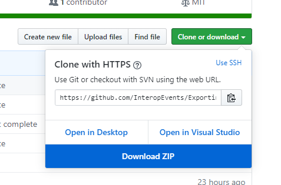
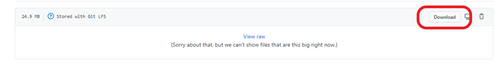

# Microsoft 365 DevDays ExportingData with OpenXML Tutorial

## Contents

- [Exporting Data using Microsoft Graph and the OpenXML SDK](#exporting-data-using-microsoft-graph-and-the-openxml-sdk)
- [What the code does](#what-the-code-does)
- [Prerequisites](#prerequisites)
- [Get started](#get-started)
- [Follow the tutorial](#follow-the-tutorial)

## Exporting Data using Microsoft Graph and the OpenXML SDK 

In this repo you'll find steps to create an application which generates an Excel workbook and modify the application to drive the worksheet generation by data.

## What the code does

The code is generated initially by the Open XML SDK Productivity Tool. This reflects C# code from a template document. This provides the base from which customization can be made.

The worksheet generation is modified using snippets in this tutorial to build a table from Microsoft Graph generated JSON data.

## Prerequisites

- Microsoft Office account tenant for your team
- [Visual Studio](https://visualstudio.microsoft.com/downloads) (Community is fine)
  - NOTE: Install the [following workloads](Assets/vsinstallworkloads.png) for VS:
        - .Net desktop development
        - Office/Sharepoint development
        - .Net Core cross-platform development
- [Git command line tools](https://git-scm.com/downloads)
- Web browser (Chrome or Edge are fine)
- [Open XML SDK Productivity Tool](https://github.com/InteropEvents/ExportingDataOpenXMLTools)
- [Open XML SDK from nuget.org](https://www.nuget.org/packages/DocumentFormat.OpenXml)

## Get started

### Local Share: `https://aka.ms/DevDaysWorkshop`

1. Start by cloning this whole repository to your local system so you have all the data files, example reports, and folders. Use the Github `Clone or download` button to copy the URL and then issue this command:

    `git clone https://github.com/InteropEvents/ExportingDataWithOpenXMLTutorial.git`

1. Or, alternatively, download the zip file using the Github `Clone or download` button:

    

1. If you haven't already retrieved the *OpenXML SDK Productivity Tool .msi installer* from a local share, download it here:

    [OpenXMLSDKToolV25.msi](Assets/OpenXMLSDKToolV25.msi)

    Just click on the "Download" button:

    

    The same MSI is also here:

    [https://github.com/InteropEvents/ExportingDataOpenXMLTools](https://github.com/InteropEvents/ExportingDataOpenXMLTools)

   The `OpenXMLSDKToolV25.msi` in that repo will install the Open XML SDK Productivity Tool used in Module 1.

1. You can also clone the working solution to a separate folder for reference from here: 

    `git clone https://github.com/InteropEvents/ExportingDataWithOpenXMLSolution.git`

## Follow the tutorial

1. Now you are ready to follow the tutorial. Start with [Module 1](Module1.md), which walks you through generating the initial C# Open XML SDK project.

1. Complete the main tutorial by following [Module 2](Module2.md). This will lead you through generating the Microsoft Graph data and  and customizing the code to use the Microsoft Graph data to build the worksheet table.

<!-- 1. If you have time, follow the [Advanced Module](AdvancedModule.md) to generate web extension parts which will pin or autoload the Excel add-in to this tutorial's workbook. -->
